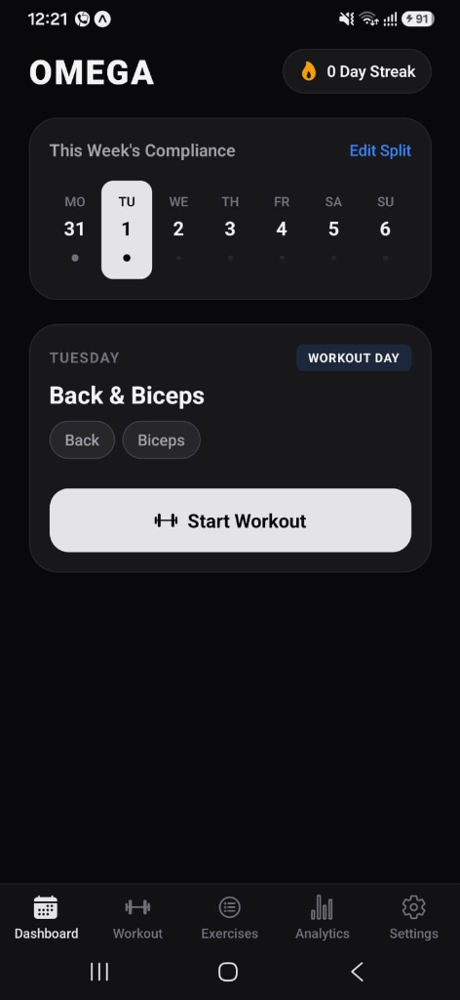
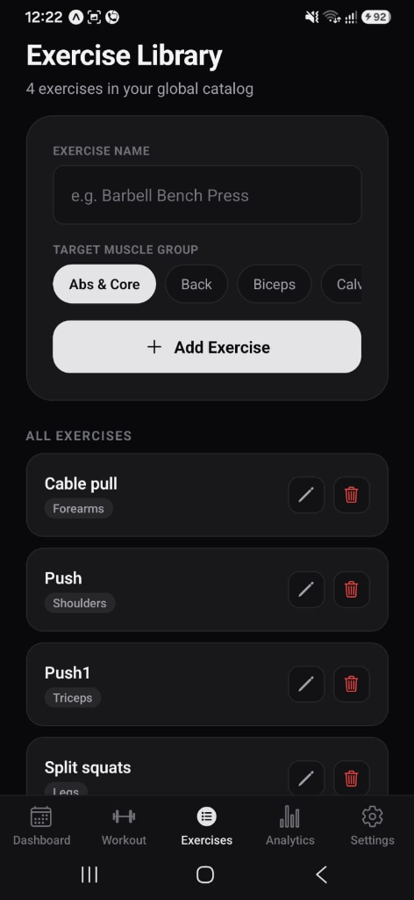
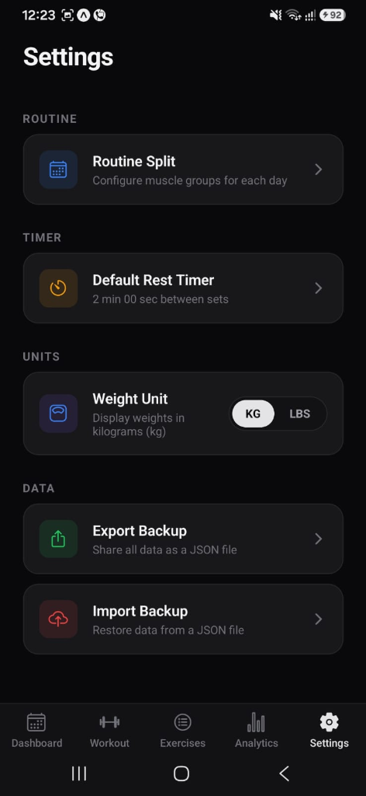
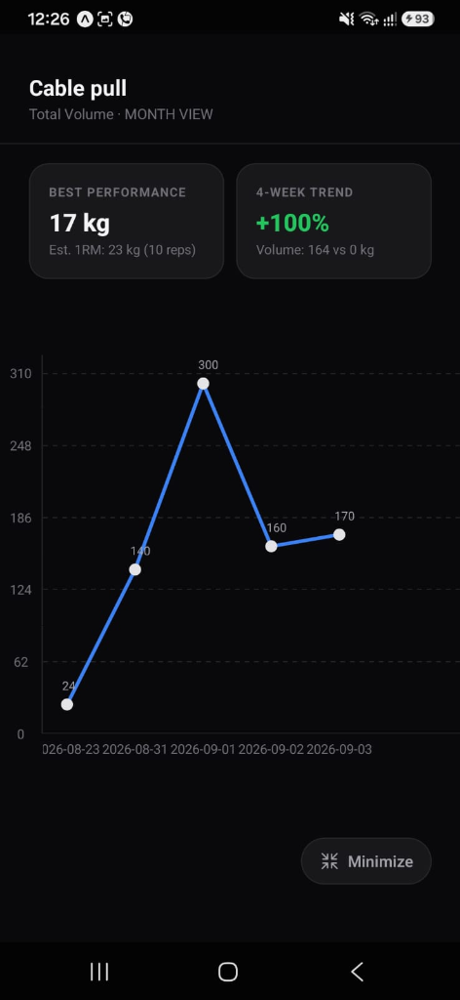

# Omega Gym Tracker

> **A local-first, privacy-focused workout tracker and progressive overload manager built with React Native, Expo, TypeScript, and SQLite.**

Track workouts, build custom routines, monitor strength progression, and analyze training volume — **without user accounts, advertisements, telemetry, or cloud dependencies.**

---

## Preview

<p align="center">
  
  
  
  
</p>

### Screenshot Gallery

| Screen | File Path | Highlights |
|---|---|---|
| **Dashboard & Streak** | `assets/screenshots/01_dashboard.png` | 7-day compliance strip, current day split, active streak badge, one-tap session launch |
| **Exercise Library** | `assets/screenshots/02_exercise_library.png` | Global movement catalog, muscle group tagging, instant search, CRUD actions |
| **Settings & Data Backup** | `assets/screenshots/03_settings.png` | Rest timer configuration, KG/LBS preference toggle, JSON database export and import |
| **Analytics & 1RM Progression** | `assets/screenshots/04_analytics.png` | Interactive volume charts, 4-week trend comparison, estimated 1RM calculations |

---

## Core Architecture & Implemented Features

### 1. Local-First SQLite Engine & Atomic Transactions
- **Embedded Storage**: All data (exercises, day templates, split definitions, workout sessions, and set entries) is persisted locally via `expo-sqlite`.
- **Relational Integrity**: Foreign-key constraints and cascading rules guarantee safe deletion of exercises without orphaned logs or corrupted routine templates.
- **Offline-First Operation**: Zero network calls or remote server dependencies; full functionality is available completely offline.

### 2. Active Workout Isolation & Crash Recovery
- **Real-Time Session Persistence**: Active set inputs, weight, reps, and exercise ordering are continuously persisted to local AsyncStorage draft storage (`@active_workout_draft`).
- **Crash Recovery Banner**: When returning to the app or navigating screens during an active session, a persistent **"Workout in Progress — [Resume] | [Discard]"** banner allows immediate session recovery, preventing data loss across background app terminations.
- **Atomic Log Finalization**: Completing a session writes all completed sets into SQLite in a single transaction before purging the working draft.

### 3. Rest Timer with Haptic & Audio-Visual Alerts
- **Configurable Countdown**: Minute and second rest intervals customizable per session and stored in persistent preferences.
- **Native Haptic Feedback**: Triggers a 3-pulse vibration pattern on Android (`Vibration.vibrate([0, 400, 200, 400])`) and success haptics on iOS (`expo-haptics`) when the countdown reaches zero.
- **Safe Foreground Lifecycle**: Independent in-app countdown state with foreground notification fallbacks that gracefully isolate environments without crashing.

### 4. Dynamic Unit Conversion & Weekly Split Engine
- **KG <-> LBS Dynamic Unit Engine**: First-launch onboarding prompt and instantaneous toggle in Settings. Converts canonical database kg storage to display units on the fly across workout logging, historical benchmarks, and progression charts.
- **Customizable Routine Splits**: Multi-muscle group assignment per day of the week (Monday through Sunday) supporting PPL, Upper/Lower, Arnold Split, Bro Split, or fully custom routines.
- **Previous Session Benchmarks**: Dynamically fetches and displays the exact weight and rep numbers achieved during the previous workout for each exercise.

### 5. Data Portability (JSON Export & Import)
- **Full Database Export**: Serializes the entire relational database into a standardized, human-readable JSON schema and opens the native device share sheet via `expo-sharing`.
- **Validated Restoration**: Imports JSON backup files via `expo-document-picker`, validates schema structure, and restores exercises, splits, templates, and logs within atomic database operations.

### 6. Automated Unit Testing (100% Core Coverage)
Comprehensive Jest test suites covering core domain calculation and date math logic:
- **1RM Calculations**: Validated Epley formula $\text{Weight} \times (1 + \frac{\text{Reps}}{30})$ with verified parity for 1-rep maxes, 0-rep guards, high-rep bounds, and NaN/invalid input sanitization.
- **Volume Aggregation**: Multi-exercise volume summing with edge-case handling for malformed sets.
- **Reversible Unit Conversions**: Validated $1\text{ kg} \approx 2.20462\text{ lbs}$ conversion parity and 1-decimal-place rounding.
- **Streak & ISO Week Math**: Validated consecutive streak calculations, duplicate same-day session normalization, multi-day gap resets, and ISO 8601 week boundary transitions across month and year boundaries.

---

## Tech Stack

| Layer | Technology | Version | Purpose |
|---|---|---|---|
| **Core Framework** | [React Native](https://reactnative.dev/) / [Expo](https://expo.dev/) | RN 0.81 / Expo SDK 54 | Cross-platform mobile foundation |
| **Language** | [TypeScript](https://www.typescriptlang.org/) | 5.9 | Static type safety and data models |
| **Database** | [expo-sqlite](https://docs.expo.dev/versions/latest/sdk/sqlite/) | 16.0 | Local embedded relational database |
| **State Management** | [Zustand](https://github.com/pmndrs/zustand) | 5.0 | Global in-memory UI and catalog state |
| **Navigation** | [React Navigation](https://reactnavigation.org/) | 7.x | Bottom tabs and native stack routing |
| **Data Visualization** | [react-native-gifted-charts](https://github.com/Abhinandan-Kushwaha/react-native-gifted-charts) | 1.4 | Progression and volume line charts |
| **Vector Graphics** | [react-native-svg](https://github.com/software-mansion/react-native-svg) | 15.12 | Chart and visual rendering |
| **Haptics & Vibration** | [expo-haptics](https://docs.expo.dev/versions/latest/sdk/haptics/) | 15.0 | Timer completion feedback |
| **Date Calculations** | [date-fns](https://date-fns.org/) | 4.1 | ISO 8601 calendar and date arithmetic |
| **Testing** | [Jest](https://jestjs.io/) / [jest-expo](https://docs.expo.dev/develop/unit-testing/) | Jest 30 | Automated unit testing |

---

## Directory Structure

```text
counterapp/
├── assets/
│   └── screenshots/          # Application preview captures
├── src/
│   ├── components/           # Reusable UI elements (RestTimerModal, DraftBanner, etc.)
│   ├── hooks/                # Custom React hooks (useTimeSync, useWeightUnit)
│   ├── screens/              # Core application screens
│   │   ├── ActiveWorkoutScreen.tsx
│   │   ├── AnalyticsScreen.tsx
│   │   ├── DashboardScreen.tsx
│   │   ├── ExercisesScreen.tsx
│   │   ├── SettingsScreen.tsx
│   │   ├── SplitSetupScreen.tsx
│   │   └── WorkoutDaysScreen.tsx
│   ├── services/             # Local database, backup, notifications, preferences
│   │   ├── backupService.ts
│   │   ├── database.ts
│   │   ├── notificationService.ts
│   │   ├── restTimerPrefs.ts
│   │   ├── timerAlertService.ts
│   │   ├── weightUnitPrefs.ts
│   │   └── workoutDraftService.ts
│   ├── store/                # Zustand application store
│   ├── theme/                # Color palettes and visual constants
│   ├── types/                # TypeScript interface and type declarations
│   └── utils/                # Domain math and date calculations
│       ├── calculations.ts
│       ├── dateUtils.ts
│       └── __tests__/        # Jest unit test suites
├── App.tsx                   # Main entry point and navigation tree
├── app.json                  # Expo project configuration
├── package.json              # Project dependencies and test scripts
└── tsconfig.json             # TypeScript configuration
```

---

## Local Development & Testing

### Prerequisites
- Node.js 18+
- npm 9+
- Expo Go application or Android/iOS emulator

### Setup
```bash
# Clone the repository
git clone https://github.com/RonnieRobert/Gym-Tracker-App.git
cd Gym-Tracker-App

# Install project dependencies
npm install
```

### Running the App
```bash
# Start the Expo development bundler
npm run start
```
- Press `a` to open on an Android emulator / connected device.
- Press `i` to open on an iOS simulator.
- Scan the Metro terminal QR code with Expo Go.

### Executing Tests & Quality Checks
```bash
# Run TypeScript compilation check
npx tsc --noEmit

# Run Jest unit test suites with coverage report
npm test -- --coverage
```

---

## Build Android APK (EAS Build)

```bash
# Install EAS CLI
npm install -g eas-cli

# Authenticate with Expo Application Services
eas login

# Trigger cloud build for Android APK preview
eas build -p android --profile preview
```

---

## License

This project is licensed under the [MIT License](LICENSE).
