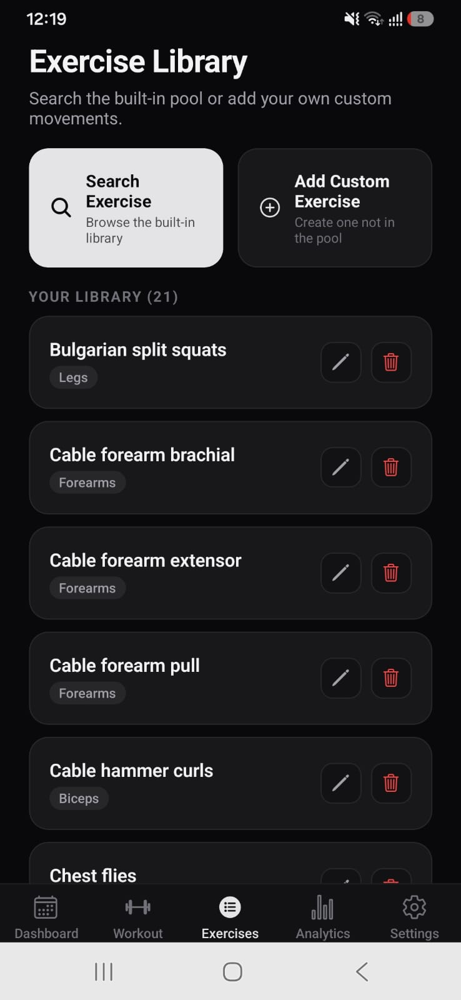

# Omega Gym Tracker

[](https://github.com/ASSAS-Labs/Omega/actions/workflows/ci.yml)


> **A local-first, privacy-focused workout tracker and progressive overload manager built with React Native, Expo, TypeScript, and SQLite.**

Track workouts, build custom routines, monitor strength progression, and analyze training volume — **without user accounts, advertisements, telemetry, or cloud dependencies.**

---

## Preview

<p align="center">
  
  
  
  
</p>

### Screenshot Gallery

| Screen | File Path | Highlights |
|---|---|---|
| **Dashboard & Streak** | `assets/screenshots/01_dashboard.png` | 7-day compliance strip, current day split, tappable streak badge with all-time top-5 streak history, one-tap session launch |
| **Exercise Library** | `assets/screenshots/02_exercises-tab.png` | Global movement catalog, muscle group tagging, instant search, CRUD actions |
| **Settings & Data Backup** | `assets/screenshots/03_settings.png` | Rest timer configuration, KG/LBS preference toggle, JSON database export and import |
| **Analytics & 1RM Progression** | `assets/screenshots/04_analytics.png` | Session/week/month progression filters, peak-benchmark aggregation, stacked date axis labels, 4-week trend comparison, estimated 1RM calculations |

---

## Continuous Integration & Quality Assurance

Every commit and pull request is automatically validated through a GitHub Actions CI pipeline with strict quality gates:

```text
Code Commit / Pull Request
           │
           ▼
     GitHub Actions
           │
           ├── 1. Clean Dependency Installation (`npm ci --legacy-peer-deps`)
           ├── 2. TypeScript Compilation Check (`npx tsc --noEmit`)
           └── 3. Automated Jest Test Suite (`npm test -- --ci --watchAll=false`)
                      │
                      ▼
               Quality Gate Passed (0 errors / 178 tests passing)
```

> **Node requirement:** the service test suites execute the real schema on Node's built-in SQLite engine (`node:sqlite`), so tests require **Node.js 22.13+** (CI runs Node 24).

### Verified Test Matrix

| Quality Gate | Verification Command | Scope & Verified Logic | Result |
|---|---|---|---|
| **TypeScript Typecheck** | `npx tsc --noEmit` | Strict compilation across all screens, hooks, services, components, and types | **0 errors** |
| **1RM Epley Formula** | `npm test` (`calculations.test.ts`) | $W \times (1 + R/30)$, 1-rep parity, 0-rep guards, high-rep bounds, NaN handling | **Passed** |
| **Volume Aggregation** | `npm test` (`calculations.test.ts`) | Multi-exercise set summation, malformed set input sanitization | **Passed** |
| **Weight Unit Conversion** | `npm test` (`calculations.test.ts`) | $1\text{ kg} \approx 2.20462\text{ lbs}$, 1-decimal rounding, reversible round-trip parity | **Passed** |
| **Streak & Gap Math** | `npm test` (`dateUtils.test.ts`) | Consecutive days, same-day multi-session deduplication, $\ge 2$ day gap resets | **Passed** |
| **All-Time Streak History** | `npm test` (`dateUtils.test.ts`) | `calculateAllStreaks`: single runs, multi-streak resets, zero workouts, same-day sessions, descending ranking | **Passed** |
| **Analytics Aggregation** | `npm test` (`analyticsCalculations.test.ts`) | SESSION/WEEK/MONTH bucketing, Monday-Sunday ISO weeks, monthly peaks, stacked axis labels, 30% chart headroom, bucket caps | **Passed** |
| **Weekly Target Compliance** | `npm test` (`dateUtils.test.ts`) | ISO 8601 week transitions, month and year boundary transitions, target met flags | **Passed** |
| **Relative Date Formatting** | `npm test` (`dateUtils.test.ts`) | "Today", "Yesterday", "X days ago", ISO string sanitization, fallback formats | **Passed** |
| **Schema Versioning & Migrations** | `npm test` (`database.test.ts`) | `PRAGMA user_version` stamping (0 -> 1), legacy pre-versioning repair, relaunch idempotency | **Passed** |
| **Referential Integrity** | `npm test` (`database.test.ts`) | Foreign-key rejection, cascade on exercise delete, FK-safe weekly split and template writes | **Passed** |
| **Transactional Writes** | `npm test` (`database.test.ts`) | Routine day insertion/replacement, workout set logging, idempotent re-saves, mid-transaction rollback | **Passed** |
| **SQLite Concurrency** | `npm test` (`database.test.ts`, `useAppStore.test.ts`) | WAL journal mode and 5s busy timeout on every connection open, writes held back until in-flight store reads settle, failed reads never blocking a write | **Passed** |
| **Crash-Recovery Drafts** | `npm test` (`workoutDraftService.test.ts`) | Draft save/retrieve round-trip, malformed payload rejection, atomic discard vs. debounced auto-save, concurrent hydration | **Passed** |
| **Backup Portability** | `npm test` (`backupService.test.ts`) | JSON export/import round-trip parity, malformed/partial payload rejection, rollback on invalid restore, picker integration | **Passed** |
| **Alarm Resilience (Android 13+)** | `npm test` (`notifeeTimerService.test.ts`) | Exact-alarm permission probing, single per-session settings redirect, inexact fallback, unique per-run ids, cancellation sweep | **Passed** |
| **Streak Sheet UI** | `npm test` (`StreakHistoryModal.test.tsx`) | Ranked rows from real logged days, singular/plural day labels, same-day deduplication, five prompt slots when empty, (X) dismissal | **Passed** |
| **Rest Timer Picker UI** | `npm test` (`RestTimerModal.test.tsx`) | Saved-default loading, minute/second stepper clamping (0-60 / 0-59), disabled controls while running, exact seconds handed to the scheduler | **Passed** |
| **Dashboard Integration** | `npm test` (`DashboardScreen.test.tsx`) | Header badge renders the live streak and opens the all-time streak sheet | **Passed** |
| **Analytics Screen Integration** | `npm test` (`AnalyticsScreen.test.tsx`) | SESSION default, WEEK/MONTH re-aggregation, peak benchmarks, stacked axis labels, 30% headroom, two-line title wrap, pinned metric toggle, streak sheet trigger | **Passed** |
| **Code Coverage** | `npm test -- --coverage` | Statements/lines/functions: `calculations.ts`, `dateUtils.ts`, `analyticsCalculations.ts` at **100%**; services at **90%+**; components and screens covered by render suites | **Passed** |

---

## Core Architecture & Implemented Features

### 1. Local-First SQLite Engine & Atomic Transactions
- **Embedded Storage**: All data (exercises, day templates, split definitions, workout sessions, and set entries) is persisted locally via `expo-sqlite`.
- **Relational Integrity**: Foreign-key constraints and cascading rules guarantee safe deletion of exercises without orphaned logs or corrupted routine templates.
- **Concurrent Access**: Every connection opens with the WAL journal mode and a 5-second busy timeout (`PRAGMA busy_timeout`), so a read in flight never makes a concurrent write fail with `database is locked`.
- **Versioned Schema**: Initialization checks `PRAGMA user_version`; a fresh database builds the base schema, repairs any pre-versioning legacy state, and stamps version `1`, so later launches skip the DDL entirely.
- **Offline-First Operation**: Zero network calls or remote server dependencies; full functionality is available completely offline.

### 2. Active Workout Isolation & Crash Recovery
- **Real-Time Session Persistence**: Active set inputs, weight, reps, and exercise ordering are continuously persisted to local AsyncStorage draft storage (`@active_workout_draft`).
- **Crash Recovery Banner**: When returning to the app or navigating screens during an active session, a persistent **"Workout in Progress — [Resume] | [Discard]"** banner allows immediate session recovery, preventing data loss across background app terminations.
- **Atomic Log Finalization**: Completing a session writes all completed sets into SQLite in a single transaction before purging the working draft.

### 3. Rest Timer with Notifee Background Alerts & Haptics
- **Configurable Countdown**: Minute and second rest intervals customizable per session and stored in persistent preferences.
- **In-Workout Duration Picker**: The active workout timer sheet exposes interactive minute (0-60) and second (0-59) steppers, so the exact rest duration for the current set is dialled in and passed straight to the notification scheduler.
- **Robust Background Notifications**: Uses `@notifee/react-native` to reliably schedule and deliver timer completion notifications even when the app is completely backgrounded or closed.
- **Android 13+ Alarm Resilience**: Exact-alarm capability is probed before every schedule; if the `SCHEDULE_EXACT_ALARM` special-access permission is restricted, the user is routed once per session to the system "Alarms & reminders" screen and the alert automatically falls back to the OS's inexact scheduling path instead of silently failing.
- **Native Haptic Feedback**: Triggers a 3-pulse vibration pattern on Android (`Vibration.vibrate([0, 400, 200, 400])`) and success haptics on iOS (`expo-haptics`) when the countdown reaches zero.

### 4. Dynamic Unit Conversion & Weekly Split Engine
- **KG <-> LBS Dynamic Unit Engine**: First-launch onboarding prompt and instantaneous toggle in Settings. Converts canonical database kg storage to display units on the fly across workout logging, historical benchmarks, and progression charts.
- **Customizable Routine Splits**: Multi-muscle group assignment per day of the week (Monday through Sunday) supporting PPL, Upper/Lower, Arnold Split, Bro Split, or fully custom routines.
- **Previous Session Benchmarks**: Dynamically fetches and displays the exact weight and rep numbers achieved during the previous workout for each exercise.

### 5. Pre-Seeded Exercise Library & Custom Movements
- **Pre-populated Pool**: The app ships with a comprehensive pool of standard exercises, fully categorized by muscle groups (Chest, Back, Legs, etc.), allowing users to immediately begin logging without manual data entry.
- **Custom Exercises**: Users can seamlessly add custom movements directly into the local catalog, which are fully supported across all split assignments, statistics, and workout logs.

### 6. Data Portability (JSON Export & Import)
- **Full Database Export**: Serializes the entire relational database into a standardized, human-readable JSON schema and opens the native device share sheet via `expo-sharing`.
- **Validated Restoration**: Imports JSON backup files via `expo-document-picker`, validates schema structure, and restores exercises, splits, templates, and logs within atomic database operations.

### 7. Streak History & Dynamic Progression Analytics
- **All-Time Streak Ranking**: The dashboard and analytics streak badges open a "Top 5 Streaks of All Time" sheet, ranked from the longest recorded run of consecutive training days, with vacant positions inviting the next streak.
- **Dynamic Chart Filtering**: Progression charts re-aggregate instantly when switching between `WEEK`, `SESSION`, and `MONTH` (default `SESSION`): sessions plot per log, weeks collapse into Monday-Sunday peaks, and months into monthly peaks.
- **Readable Axes**: Long exercise names wrap to a second line beside the metric toggle, x-axis dates render as stacked `day month` / `'year` labels, and the y-axis carries 30% headroom so floating value labels are never clipped.

---

## Tech Stack

| Layer | Technology | Version | Purpose |
|---|---|---|---|
| **Core Framework** | [React Native](https://reactnative.dev/) / [Expo](https://expo.dev/) | RN 0.81 / Expo SDK 54 | Cross-platform mobile foundation |
| **Language** | [TypeScript](https://www.typescriptlang.org/) | 5.9 | Static type safety and data models |
| **Database** | [expo-sqlite](https://docs.expo.dev/versions/latest/sdk/sqlite/) | 16.0 | Local embedded relational database |
| **State Management** | [Zustand](https://github.com/pmndrs/zustand) | 5.0 | Global in-memory UI and catalog state |
| **Navigation** | [React Navigation](https://reactnavigation.org/) | 7.x | Bottom tabs and native stack routing |
| **Data Visualization** | [react-native-gifted-charts](https://github.com/Abhinandan-Kushwaha/react-native-gifted-charts) | 1.4 | Progression and volume line charts |
| **Vector Graphics** | [react-native-svg](https://github.com/software-mansion/react-native-svg) | 15.12 | Chart and visual rendering |
| **Background Alerts** | [@notifee/react-native](https://notifee.app/) | 9.1 | Exact alarm scheduling and background timer notifications |
| **Local Draft Storage** | [AsyncStorage](https://react-native-async-storage.github.io/async-storage/) | 2.2 | In-progress workout draft persistence and user preferences |
| **Haptics & Vibration** | [expo-haptics](https://docs.expo.dev/versions/latest/sdk/haptics/) | 15.0 | Timer completion feedback |
| **Date Calculations** | [date-fns](https://date-fns.org/) | 4.1 | ISO 8601 calendar and date arithmetic |
| **Testing** | [Jest](https://jestjs.io/) / [jest-expo](https://docs.expo.dev/develop/unit-testing/) | Jest 30 | Automated unit testing |
| **Continuous Integration** | [GitHub Actions](https://github.com/features/actions) | - | Automated linting, typecheck, and unit test CI pipeline |

---

## Directory Structure

```text
counterapp/
├── __mocks__/                # Jest manual mocks (real SQLite engine, in-memory FS/storage)
├── assets/
│   └── screenshots/          # Application preview captures
├── src/
│   ├── components/           # Reusable UI elements (RestTimerModal, StreakHistoryModal, DraftBanner, etc.)
│   │   └── __tests__/        # Rendered-component behavior suites
│   ├── constants/            # Static movement catalog (exercisePool.ts)
│   ├── hooks/                # Custom React hooks (useTimeSync, useWeightUnit)
│   ├── screens/              # Core application screens
│   │   ├── __tests__/        # Dashboard and analytics screen integration suites
│   │   ├── ActiveWorkoutScreen.tsx
│   │   ├── AnalyticsScreen.tsx
│   │   ├── DashboardScreen.tsx
│   │   ├── ExercisesScreen.tsx
│   │   ├── SettingsScreen.tsx
│   │   ├── SplitSetupScreen.tsx
│   │   └── WorkoutDaysScreen.tsx
│   ├── services/             # Local database, backup, notifications, preferences
│   │   ├── backupService.ts
│   │   ├── database.ts
│   │   ├── notifeeTimerService.ts
│   │   ├── restTimerPrefs.ts
│   │   ├── timerAlertService.ts
│   │   ├── weightUnitPrefs.ts
│   │   ├── workoutDraftService.ts
│   │   └── __tests__/        # Service integration suites (SQLite, drafts, backup, alarms)
│   ├── store/                # Zustand application store
│   │   └── __tests__/        # Store read/write ordering suite
│   ├── theme/                # Color palettes and visual constants
│   ├── types/                # TypeScript interface and type declarations
│   └── utils/                # Domain math, analytics aggregation, and date calculations
│       ├── analyticsCalculations.ts
│       ├── calculations.ts
│       ├── dateUtils.ts
│       └── __tests__/        # Jest unit test suites
├── App.tsx                   # Main entry point and navigation tree
├── app.json                  # Expo project configuration
├── eas.json                  # Expo Application Services build configuration
├── package.json              # Project dependencies and test scripts
└── tsconfig.json             # TypeScript configuration
```

---

## Local Development & Testing

### Prerequisites
- Node.js 22.13+ (Node 24 recommended — the service suites use `node:sqlite`)
- npm 9+
- Expo Go application or Android/iOS emulator

### Setup
```bash
# Clone the repository
git clone https://github.com/ASSAS-Labs/Omega.git
cd Omega

# Install project dependencies
npm install
```

### Running the App
```bash
# Start the Expo development bundler
npm run start
```
- Press `a` to open on an Android emulator / connected device.
- Press `i` to open on an iOS simulator.
- Scan the Metro terminal QR code with Expo Go.

### Executing Tests & Quality Checks
```bash
# Run TypeScript compilation check
npx tsc --noEmit

# Run Jest unit test suites with coverage report
npm test -- --coverage
```

The suite is split into three layers:

- **Domain unit tests** (`src/utils/__tests__/`) — pure date arithmetic, streak math, aggregation, and unit conversion.
- **Service integration tests** (`src/services/__tests__/`) — exercise the data layer, crash-recovery drafts, backup portability, and notification scheduling. Native modules are replaced by the manual mocks in `__mocks__/`, and the SQLite suites run against a genuine in-memory SQLite engine, so foreign keys, cascades, and transaction rollbacks are really enforced during the run.
- **UI render suites** (`src/components/__tests__/`, `src/screens/__tests__/`) — render the streak sheet, rest-timer picker, dashboard, and analytics screens with `react-test-renderer` (bundled with `jest-expo`) and assert the text a user actually sees plus the props handed to the chart and notification layers. The progression chart is doubled in tests so its animation timers cannot perturb the run.

---

## Build Android APK (EAS Build)

```bash
# Install EAS CLI
npm install -g eas-cli

# Authenticate with Expo Application Services
eas login

# Trigger cloud build for Android APK preview
eas build -p android --profile preview
```

---

## License

This project is licensed under the **PolyForm Noncommercial License 1.0.0**. You are free to view, clone, fork, and contribute for personal and educational purposes, but commercial use, sales, and monetized distribution are strictly prohibited. See the [LICENSE](LICENSE) file for details.

